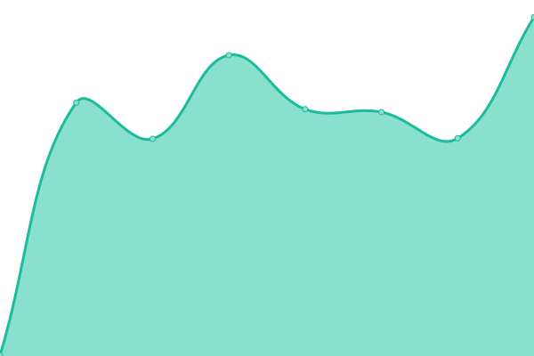
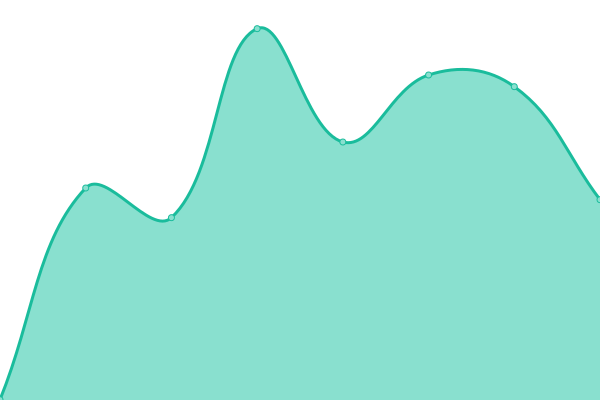
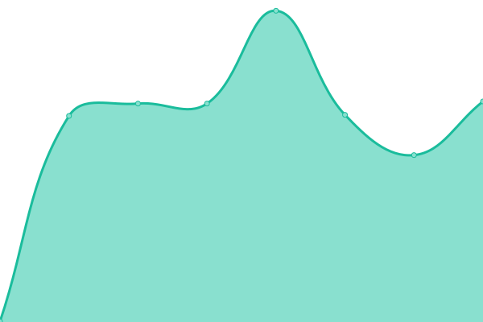

# [📈 Live Status](https://riatlas-admin.github.io/uptime): <!--live status--> **🟧 Partial outage**

This repository contains the open-source uptime monitor and status page for [riatlas-admin](https://riatlas-admin.github.io/uptime), powered by [Upptime](https://github.com/upptime/upptime).

With [Upptime](https://upptime.js.org), you can get your own unlimited and free uptime monitor and status page, powered entirely by a GitHub repository. We use [Issues](https://github.com/riatlas-admin/uptime/issues) as incident reports, [Actions](https://github.com/riatlas-admin/uptime/actions) as uptime monitors, and [Pages](https://riatlas-admin.github.io/uptime) for the status page.

<!--start: status pages-->
<!-- This summary is generated by Upptime (https://github.com/upptime/upptime) -->
<!-- Do not edit this manually, your changes will be overwritten -->
<!-- prettier-ignore -->
| URL | Status | History | Response Time | Uptime |
| --- | ------ | ------- | ------------- | ------ |
|  Archetipo CWA | 🟩 Up | [archetipo-cwa.yml](https://github.com/riatlas/uptime/commits/HEAD/history/archetipo-cwa.yml) | 

 413ms
     
 | 

<a href="https://status.static.riatlas.net/history/archetipo-cwa">100.00%</a>
    

|  CWA (dev) | 🟩 Up | [cwa-dev.yml](https://github.com/riatlas/uptime/commits/HEAD/history/cwa-dev.yml) | 

 478ms
     
 | 

<a href="https://status.static.riatlas.net/history/cwa-dev">100.00%</a>
    

|  Epicare | 🟩 Up | [epicare.yml](https://github.com/riatlas/uptime/commits/HEAD/history/epicare.yml) | 

 837ms
     
 | 

<a href="https://status.static.riatlas.net/history/epicare">100.00%</a>
    

|  Nemolab | 🟥 Down | [nemolab.yml](https://github.com/riatlas/uptime/commits/HEAD/history/nemolab.yml) | 

 3619ms
     
 | 

<a href="https://status.static.riatlas.net/history/nemolab">84.46%</a>
    

<!--end: status pages-->

[**Visit our status website →**](https://status.static.riatlas.net/)

## 📄 License

- Powered by: [Upptime](https://github.com/upptime/upptime)
- Code: [MIT](./LICENSE) © [riatlas-admin](https://riatlas-admin.github.io/uptime)
- Data in the `./history` directory: [Open Database License](https://opendatacommons.org/licenses/odbl/1-0/)
